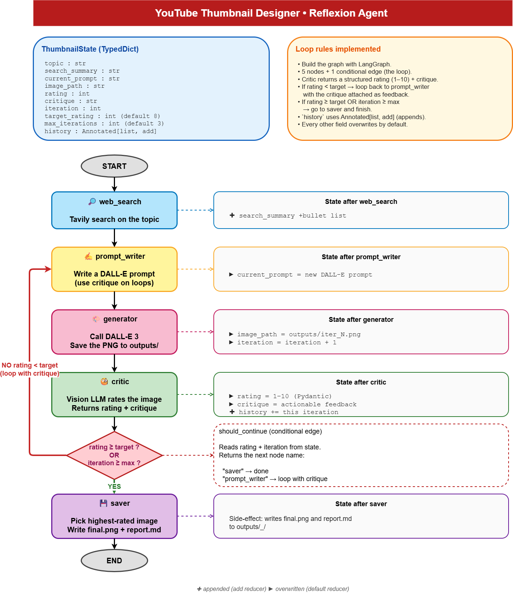

# YouTube Thumbnail Designer

A LangGraph reflection agent that takes a video topic, searches the web for hooks and references, writes a thumbnail prompt, generates an image, critiques it with a vision model, loops until a quality threshold is met, and saves the best result.

## Architecture

This project follows the required LangGraph architecture:

- `web_search`: one-time Tavily search that stores `search_summary`
- `prompt_writer`: writes or rewrites the image prompt using prior critique
- `generator`: generates `iter_N.png` and increments `iteration`
- `critic`: returns structured `rating` and `critique`, then appends to `history`
- `saver`: chooses the best image and writes `final.png` and `report.md`
- `should_continue`: conditional edge that routes to `prompt_writer` or `saver`



## Requirements satisfied

- Built with `StateGraph`, `START`, `END`, and `graph.compile()`
- Five nodes registered with `add_node`
- One loop via `add_conditional_edges`
- Typed state schema with reducer-backed `history`
- Structured critic output using Pydantic and `with_structured_output()`
- Stops when `rating >= target_rating` or `iteration >= max_iterations`
- Writes `outputs/<timestamp>_<topic>/iter_N.png`, `final.png`, and `report.md`
- Includes `python -m ytb_thumb_design_agent.make_diagram` for `graph.png`

## Project structure

```text
ytb_thumb_design_agent/
  __init__.py
  state.py
  prompts.py
  tools.py
  nodes.py
  graph.py
  main.py
  make_diagram.py
outputs/
docs/
```

## Setup

```bash
cp .env.example .env
# add OPENAI_API_KEY and TAVILY_API_KEY
uv sync
```

## Run

```bash
python -m ytb_thumb_design_agent.main "Why Python is the best language for AI"
python -m ytb_thumb_design_agent.main "Why Python is the best language for AI" --stream
```

## Diagram

```bash
python -m ytb_thumb_design_agent.make_diagram
```

## Notes

- The generator uses the GPT image model image generation model through the current OpenAI images API.
- `outputs/` is gitignored by default, but for submission one sample run should be committed temporarily so the grader can inspect `report.md` and see the loop fire.
